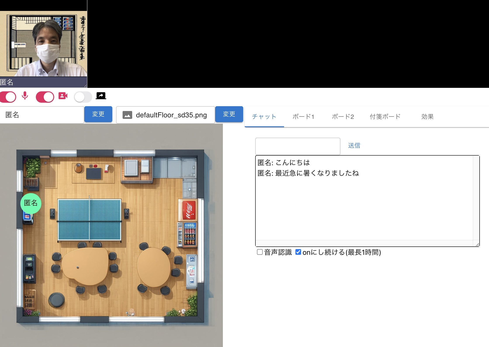

# Presence - Video Meeting with Collaboration Tools

Presenceは、[分散情報共有基盤 Madoi](https://github.com/kcg-edu-future-lab/madoi)の実証のために開発されたコレボレーションツール付きビデオ会議システムです(Chrome推奨)。
ReactとTypeScriptを使用して開発されています。
基本的なビデオ会議機能に加えて、チャットやホワイトボードなどのコラボレーションツール、2D仮想空間と連動した音声ボリューム調整機能を備えています。

画面例:


# 機能

以下の機能が実装されています。

- ビデオ会議(画面上部) [ソース](https://github.com/kcg-edu-future-lab/presence/blob/main/src/components/videomeeting/VideoMeeting.tsx)
  - `keys.ts` の `skyWayEnabled` を `true` にし、SkyWayのIDとシークレットを設定すれば、ビデオ会議機能が有効になります。カメラや画面共有、マイクの共有には[SkyWay](https://skyway.ntt.com/ja/)を使用しています。仮想背景の実装にはGoogleの[mediapipe](https://ai.google.dev/edge/mediapipe/solutions/guide?hl=ja)を利用しています。
  - 利用者の入退室管理にMadoiを使用しています。
- 仮想オフィス(画面左下) [ソース](https://github.com/kcg-edu-future-lab/presence/blob/main/src/components/virtualroom/VirtualRoom.tsx)
  - 背景画像上に利用者を表すアバター(円に名前が描画されたもの)が描画されます。アバター同士が近ければ声が聞こえ、遠くなると声が小さくなります。
  - アバターの位置の共有にMadoiを使用しています。
- チャット(画面右下のツールの一つ) [ソース](https://github.com/kcg-edu-future-lab/presence/blob/main/src/components/meetingchat/Chat.tsx)
  - 音声認識を備えたシンプルなチャットです。
  - 円の位置の共有にMadoiを使用しています。
- ホワイトボード(画面右下のツールの一つ) [ソース](https://github.com/kcg-edu-future-lab/presence/blob/main/src/components/whiteboard/Whiteboard.tsx)
  - シンプルな描画ツールです。
  - 描画内容の共有にMadoiを使用しています。
- 付箋ボード(画面右下のツールの一つ) [ソース](https://github.com/kcg-edu-future-lab/presence/blob/main/src/components/tagboard/TagBoard.tsx)
  - 付箋を貼り付けられる共有ボードです。
  - 付箋の位置や描画内容の共有にMadoiを使用しています。
- mermaid文書の共同編集(画面右下のツールの一つ) [ソース](https://github.com/kcg-edu-future-lab/presence/blob/main/src/components/mermaid/Mermaid.tsx)
  - [Yjs](https://github.com/yjs/yjs), [CodeMirror](https://codemirror.net/)を使用した [mermaid](https://mermaid.js.org/)ドキュメントの共同編集機能です。
  - YjsはUIのみで使用し、差分の共有にはMadoiを使用しています。
- 効果(画面右下のツールの一つ) [ソース](https://github.com/kcg-edu-future-lab/presence/blob/main/src/components/reaction/ReactionButtons.tsx)
  - 画面効果や効果音の再生を行います。
  - 効果の共有にMadoiを使用しています。
  - ※ 効果音は[効果音ラボ](https://soundeffect-lab.info/)のものを使用しています。


# 動作環境

Chromeでの動作確認を行なっています。

ローカルで起動(以下、`Presenceの起動`参照)するには、docker compose 又は Node.js が必要です。静的ビルドにも対応しており、
distディレクトリに生成されたファイル群をWebサーバに設置しても構いません。

Node.jsでの起動又はビルドには、以下のツールやソフトウェアが必要です。

- VSCode(他の開発環境でも構いません)
- Node.js v22以上

# 実行方法

## Madoiの起動

適当なディレクトリで以下のコマンドを実行し、Madoi の madoi-volatileserver を起動してください。詳細は、[MadoiのREADME](https://github.com/kcg-edu-future-lab/madoi)を参照してください。

```bash
git clone https://github.com/kcg-edu-future-lab/madoi
cd madoi
docker compose up
```

上記のコマンドを実行すると、Madoiのビルドが行われ、volatileserverが起動します。


## Presenceの起動

まず、このリポジトリをcloneしてください。

```bash
git clone https://github.com/kcg-edu-future-lab/presence
cd presence
```

次に /src/keys.ts.sample をコピーして、 /src/keys.ts を作成し編集して、適切に設定を行なってください。

```ts
// Madoi設定
export const madoiUrl = "ws://localhost:8080/madoi/rooms";
export const madoiKey = "MADOI_API_KEY";

// SkyWay設定
// ビデオ会議を使用する際は、skyWayEnabledにtrueを設定してskyWayAppIdとskyWaySecretを書き換えてください。
export const skyWayEnabled = false;
export const skyWayAppId = "SKYWAY_APP_ID";
export const skyWaySecret = "SKYWAY_SECRET";
```

MadoiサーバのデフォルトのMADOI_API_KEYは、[docker-compose.yml](https://github.com/kcg-edu-future-lab/madoi/blob/master/docker-compose.yml)を参照してください。

skyWayEnabledにtrueを設定し、skyWayAppIdとskyWaySecretを設定すれば、ビデオ会議機能が利用できます。
事前に[SkyWay](https://skyway.ntt.com/ja/)でアカウントを作成し、AppIdとSecretを取得してください。

次に以下のコマンドを実行し、presenceを起動してください。

```bash
docker compose up
```

起動後、http://localhost:5137/ にアクセスすると、Presenceをブラウザで利用できます(ポートを変更するには、vite.config.ts.dockerファイルを編集してください)。

このコマンドは、Node.jsのバージョン22のイメージ(node:22)を使用して、Presenceをビルドし開発モードで起動(`npm run dev`)するものです。
開発環境をセットアップし、静的ビルドを行なえば、Webサーバに配備することも可能です。


## References

- 中口孝雄, "リアルタイムコラボレーションツールのためのオブジェクト共有サービス," 電子情報通信学会技術研究報告; 信学技報, 120(232) pp.70-73, 2020. 
- 中口孝雄, "分散共有機能のサービス化に向けたプログラミングモデルの設計と実装," 電子情報通信学会技術研究報告; 信学技報, 121(157), pp.64-68, 2021.
- 中口孝雄, 秋山功, 三浦仁, 前納一希, 橋本昇, "ウィズコロナ時代のコミュニケーションツールに関する考察と試み," NAIS journal, vol.17, pp.15-20, 2023.
- 中口孝雄, 秋山功, 三浦仁, 前納一希, 橋本昇, 江尻秀彰, "生成 AI を活用するコミュニケーションツールの実現に向けた考察と試み," NAIS journal, vol.18, pp.42-47, 2024.
- (発表予定) 中口孝雄, "分散情報共有サービスMadoiを用いたコラボレーションツールの宣言的プログラミング ," 情報処理学会研究報告, 2025.
